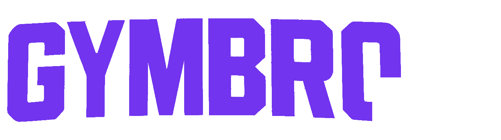

  
  
     

  
  &nbsp;&nbsp;
  

   

  

    <b>The modern bodybuilding app to track your workouts, follow your progress, and join a motivated community.</b>
  

---

## About

**Gymbro** is a comprehensive application for fitness and bodybuilding enthusiasts. Whether you are a beginner or an experienced athlete, Gymbro accompanies you in every session.

### Key Features

- **Varied Training Modes** — Classic, Timed, Circuit, Tabata, EMOM, AMRAP, For Time
- **Progress Tracking** — Complete history, evolution charts, PRs
- **iOS Live Activity** — Dynamic widget during your sessions
- **Coaching Platform** — Find a coach or become one
- **Social Feed** — Share your workouts and follow friends
- **Exercise Library** — +500 exercises with instructions

---

## Roadmap

Want to see what we're working on? Check out our [Full Roadmap](./ROADMAP.md).

Have a feature idea? [Open an issue](../../issues/new)!

---

## Contact

- **Email**: contact@gymbroapp.eu
- **Instagram**: 
  - 🇫🇷 [@gymbroapp_fr](https://instagram.com/gymbroapp_fr)
  - 🇺🇸 [@gymbroapp_en](https://instagram.com/gymbroapp_en)

---

  <i>Made with love by the Gymbro Team</i>

